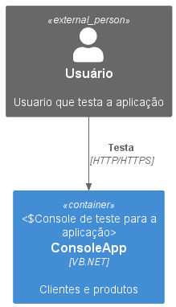

# VBNetTests

Este repositório contém testes desenvolvidos em VB.NET para validar funcionalidades e garantir a qualidade do código.

    

## Estrutura do Projeto

- **`/ConsoleVB`**: Contém os arquivos de teste.
- **`/ConsoleVB.Tests`**: Contém o código-fonte principal.

## Pré-requisitos

- Visual Studio 2022
- .NET Framework 4.8

## Frameworks de Testes

- NUnit3
- Moq

## Como Executar os Testes

1. Clone este repositório:

    ```bash
    git clone https://github.com/usuario/VBNetTests.git
    ```

2. Abra o projeto na sua IDE.
3. Compile a solução para restaurar os pacotes necessários.
4. Execute os testes usando o Test Explorer caso esteja usando o Visual Studio 2022.

## NUnit3 - Definição

NUnit3 é um framework de testes unitários para .NET que facilita a criação e execução de testes automatizados, suportando várias asserções e parametrizações.

## Moq - Utilização

Não precisa de Injeção de dependência para utilizar o Moq nesta versão do .NET Framework 4.8 mas é necessário que os métodos (Sub) implementem interfaces para isso.

## Fine Code Coverage

Fine Code Coverage é uma extensão para Visual Studio que permite visualizar a cobertura de código diretamente na IDE. Ele integra-se ao Test Explorer e fornece relatórios detalhados sobre quais partes do código foram cobertas pelos testes.

### Como Funciona

1. **Instrumentação do Código**: Durante a execução dos testes, o Fine Code Coverage analisa o código-fonte e identifica quais linhas foram executadas.
2. **Relatórios Visuais**: Ele gera relatórios em HTML e destaca as linhas cobertas e não cobertas diretamente no editor de código.
3. **Integração com Testes**: Funciona com frameworks de teste como NUnit, MSTest e xUnit.

### Como Baixar e Instalar

Para instalar o Fine Code Coverage, siga os passos abaixo:

1. Acesse o [Visual Studio Marketplace](https://marketplace.visualstudio.com/items?itemName=FortuneNgwenya.FineCodeCoverage2022).
2. Clique no botão **Download** para baixar a extensão.
3. Abra o arquivo baixado para iniciar a instalação.
4. Siga as instruções do instalador para concluir a instalação.
5. Reinicie o Visual Studio para ativar a extensão.

Após a instalação, o Fine Code Coverage estará disponível no Test Explorer do Visual Studio.

Para mais informações, consulte a [documentação oficial](https://github.com/FineCodeCoverage/FineCodeCoverage).

## Arquitetura



## Contribuição

Além de clonar e testar na sua própria máquina você pode incluir as suas próprias entidades e métodos para criar os seus testes. Só criar sua própria branch e submeter um pull request.

Acompanhe as discussões na aba "Issue" aqui neste respositório.

Clique em watch para ser avisado das atualizações deste repo.

## Licença

Este projeto está licenciado sob a [Licença BSD-3-Clause](LICENSE).
